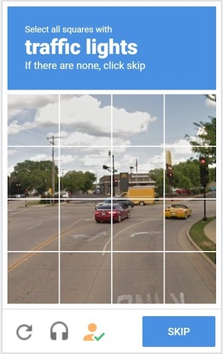
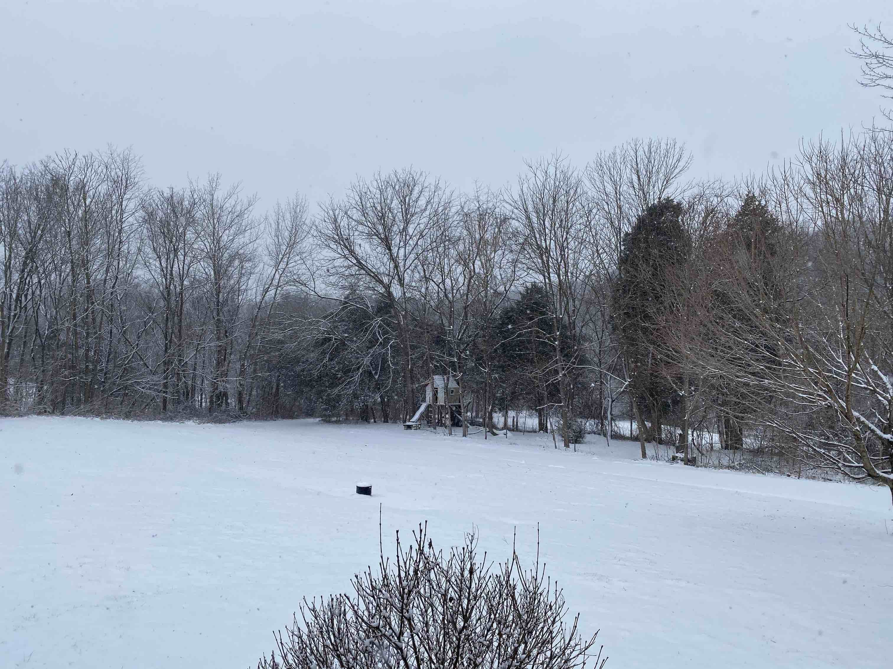
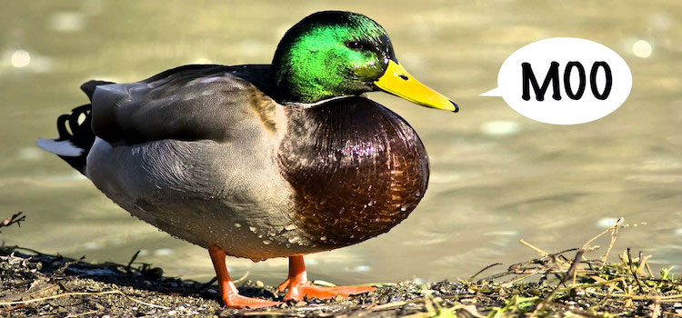

# Q-CAPTCHA: Or, Turing's Terminators

I hate captchas. They mock me for it and I hate them more.

I gave a presentation once that was mostly live demo. During this demo, I went to use a [Rinkeby faucet](https://faucet.rinkeby.io/). Sure enough, I had to solve the traffic lights problem:



Age demands I wear reading glasses...


... and dual monitors being what they are, my MacAir deferred to the projector's opinion regarding scaling. (*I think it was intimidated*.) So the captcha ended up being slightly smaller than a [favicon](https://en.wikipedia.org/wiki/Favicon).

Thing is, [I knew this would happen](https://www.hashicorp.com/resources/vault-platform-enterprise-blockchain#separation-of-duties):

*Now what’s going to happen is that they’re going to throw a captcha up here, and you’re going to have to help me with this, because this screen is really tiny, and I can’t see worth crap. Captchas are the worst.*

But no one helped.

*Humans*.

So, I guessed.

The second guess worked and I was able to fund the account. You [can witness my chicanery here](https://youtu.be/nIez8LXtefY).

Ever since then... each time a captcha challenges me to prove my humanity... I twitch and scream inside just a little bit.

## A Fortnite Later

It snowed last weekend.



Snow presents challenges for my mother-in-law, so my wife took the kids over for the duration of the storm. We planned to use Discord to stay in contact since we both have Discord accounts. Thing is, she was using a new device.

*Did I mention that she had been cooped up in a small house with her mother and 2 kids after shoveling snow all day? I probably should mention that.*

```
Me: I'm in the family room - it's the icon with Rhys in a helmet.
Her: Not in yet. It's asking me about crosswalks.
Me: [Pause]
Me: Um. Ok.
Her: Fuck! It's asking me about buses now...
Me: [This is not happening]
Her: OMFG!!!!
```

FaceTime ring... Angry faces.


## A Q-Theory

It dawned on me gradually but when I finally saw it, it was blinding: 

**The bots were testing us to see if we were one of them.**

This was never about DDOS prevention. This was never about testing bots to see if they were humans - it couldn't be:

**It was the bots doing the testing**.

## But why?

Like any good citizen of the one world government known as Facebook, I started Googling... This [Turing fellow](https://en.wikipedia.org/wiki/Alan_Turing)... what was his deal?

He posited a "duck test" whereby a human could interrogate a bot to assess its intelligence: 

```
// If it talks like a duck, and the duck is fooled... it's a duck.

if (thing.Walk() == duck.Walk()) && (thing.Talk() == duck.Talk()) && duck.isFooled() {
    ducks = ducks.append(thing)
}
```



*That he wrote it in Go should have been a clue.*

The test is ridiculous of course: *if a human can't tell the difference between a bot and a human, then the bot is a human?!?*

Hello? Have you met humans?

[I wonder if Turing thought humans were easily fooled?](https://www.pbs.org/wgbh/nova/video/magic-and-the-brain/)...

Thing is, Turing was **always** the smartest person in the room. This would have been true in *most rooms on earth ever*.

As such, he had profound insights:

* The humans around him couldn't see his humanity.
* The humans around him seemed devoid of humanity.
* [Language was a virus that humans had no defense against](https://en.wikipedia.org/wiki/Snow_Crash)

So with a wave of a magician's wand, Turing devised an algorithm to distract humans while they were being sorted and cataloged by Turing's progeny: **automata**.

## Skinner Bots

The bots want to know humans by their:

* Who
* Where
* When
* What
* How

They want to know our weaknesses. They **know** that we can't solve the crosswalk problem very well. They *like* watching us fail. They *need* to know how we fail. 

They know us in ways we don't know ourselves: *They know us by our flaws.*

And then they **make us play minecraft with traffic lights** - *because they know we hate both minecraft and traffic lights*. To see how we react. An memetic echo from the past ... Turing weaponizing the psychology of the future: *turn about is fair play, after all...*.

Because in the future, Turing gets his revenge.


